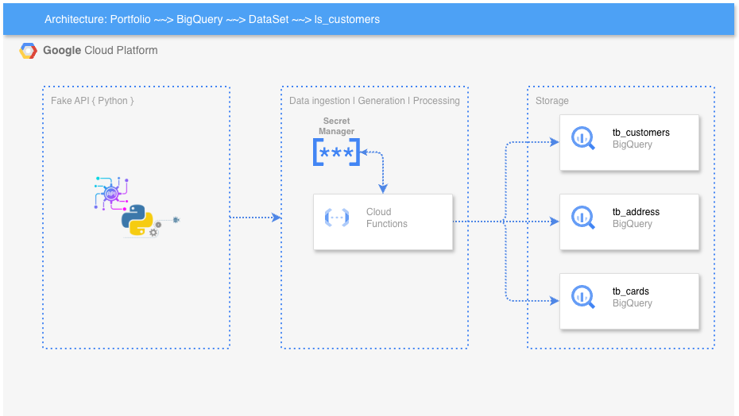
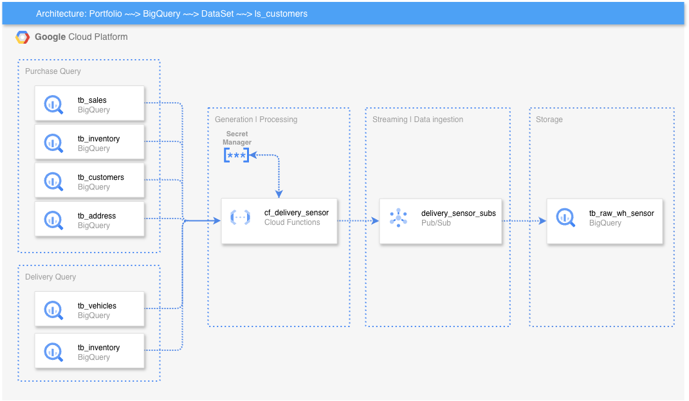
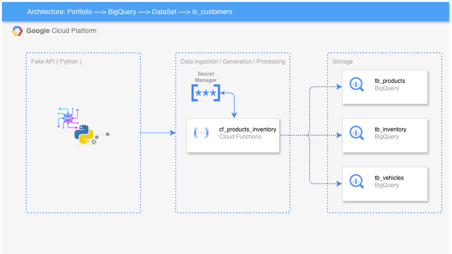
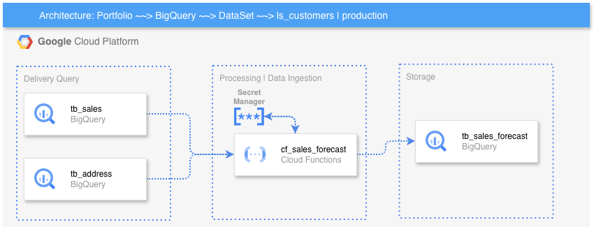
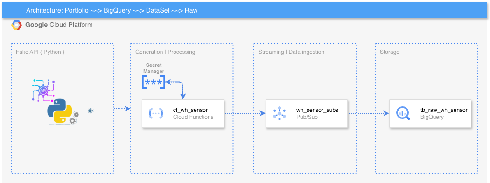

# Cloud Functions

This module contains the Google Cloud Functions responsible for supporting different stages of the data platform, including customer processing, sensor monitoring, product inventory, and sales forecasting.

The project follows a modular structure where each Cloud Function is isolated into its own directory, with dedicated source code, dependencies, utilities, and unit tests.

## 📁 Project Structure

```text
cloud_function/
├── cf_customers/
├── cf_delivery_sensor/
├── cf_products_inventory/
├── cf_sales_forecast/
└── cf_wh_sensor/
```

Each directory represents an independent Cloud Function with its own implementation and test suite.

---

## 🧩 Cloud Functions

### `cf_customers`

Responsible for customer-related data processing and transformations.

```text
cf_customers/
├── src/
│   ├── utils/
│   │   ├── bigquery.py
│   │   ├── fk_address.py
│   │   ├── fk_ids.py
│   │   ├── secret_manager.py
│   │   └── transformation.py
│   ├── index.zip
│   ├── main.py
│   └── requirements.txt
└── test/
```


The function contains utilities for:

* BigQuery integration
* Address and ID foreign-key generation
* Data transformation
* Secret Manager integration
* Cloud Function entry point

The `test/` directory contains unit tests covering the main components of the function.

---

### `cf_delivery_sensor`

Responsible for monitoring delivery-related events and interacting with messaging and data services.

```text
cf_delivery_sensor/
├── src/
│   ├── utils/
│   │   ├── bigquery.py
│   │   ├── delivery_sensor.py
│   │   ├── pub_sub.py
│   │   └── secret_manager.py
│   ├── index.zip
│   ├── main.py
│   └── requirements.txt
└── test/
```


The function integrates with:

* Google BigQuery
* Google Pub/Sub
* Google Secret Manager
* Delivery sensor processing logic

Unit tests are maintained separately under `test/`.

---

### `cf_products_inventory`

Responsible for processing product inventory-related data.

```text
cf_products_inventory/
├── src/
│   ├── utils/
│   │   ├── bigquery.py
│   │   ├── fk_dates.py
│   │   ├── fk_products.py
│   │   ├── fk_vehicle.py
│   │   └── secret_manager.py
│   ├── index.zip
│   ├── main.py
│   └── requirements.txt
└── test/
```


The function provides utilities for generating and managing relationships between:

* Dates
* Products
* Vehicles

It also provides BigQuery and Secret Manager integrations.

---

### `cf_sales_forecast`

Responsible for sales forecasting and machine learning model execution.

```text
cf_sales_forecast/
├── src/
│   ├── models/
│   ├── utils/
│   │   ├── script/
│   │   │   └── query_sql.sql
│   │   ├── bigquery.py
│   │   ├── helpers.py
│   │   ├── holtwinters_model.py
│   │   ├── prophet_model.py
│   │   ├── save_all_models.py
│   │   └── secret_manager.py
│   ├── index.zip
│   ├── main.py
│   └── requirements.txt
└── test/
```



This function is responsible for the forecasting workflow and includes implementations based on:

* Holt-Winters
* Prophet
* Supporting helper functions
* Model persistence
* BigQuery data retrieval
* SQL-based data preparation

The `models/` directory is dedicated to forecasting model components, while SQL queries used by the function are maintained under `utils/script/`.

---

### `cf_wh_sensor`

Responsible for warehouse sensor processing and event publishing.

```text
cf_wh_sensor/
├── src/
│   ├── utils/
│   │   ├── fk_sensor.py
│   │   ├── pub_sub.py
│   │   └── secret_manager.py
│   ├── index.zip
│   ├── main.py
│   └── requirements.txt
└── test/
```



The function integrates sensor-related processing with:

* Pub/Sub messaging
* Sensor foreign-key generation
* Secret Manager

Unit tests are maintained under the `test/` directory.

---

## 🏗️ Common Structure

Although each Cloud Function has a different responsibility, they follow a similar internal organization:

```text
<cloud_function>/
├── src/
│   ├── utils/
│   ├── main.py
│   ├── requirements.txt
│   └── index.zip
└── test/
```

### `src/`

Contains the production source code executed by the Cloud Function.

### `main.py`

Defines the main Cloud Function entry point and orchestrates the execution of the function.

### `utils/`

Contains reusable components and integrations specific to each Cloud Function.

Typical responsibilities include:

* BigQuery operations
* Pub/Sub communication
* Secret Manager access
* Data transformations
* Foreign-key generation
* Business logic

### `requirements.txt`

Defines the Python dependencies required by the Cloud Function.

Dependencies are isolated per function, allowing each Cloud Function to maintain only the packages required for its execution.

### `test/`

Contains unit tests for validating the behavior of the Cloud Function and its individual components.

Tests are separated from the production source code to maintain a clear distinction between application and testing logic.

### `index.zip`

Contains the packaged Cloud Function source code and dependencies required for deployment.

---

## 🔐 Google Cloud Integrations

The Cloud Functions interact with several Google Cloud services, depending on their individual responsibilities.

| Service             | Purpose                                                      |
| ------------------- | ------------------------------------------------------------ |
| **Cloud Functions** | Serverless execution of data processing workloads            |
| **BigQuery**        | Data storage, querying, and analytical processing            |
| **Pub/Sub**         | Event-driven messaging and communication                     |
| **Secret Manager**  | Secure management of credentials and sensitive configuration |
| **Cloud Storage**   | Storage and deployment of packaged artifacts                 |

---

## 🧪 Testing

Each Cloud Function maintains its own unit-test suite.

Example:

```text
cf_customers/
└── test/
    ├── test_bigquery.py
    ├── test_fk_address.py
    ├── test_fk_ids.py
    ├── test_main.py
    ├── test_secret_manager.py
    └── test_transformation.py
```

Tests are organized according to the components implemented in `src/utils/`.

The test suites can be executed independently for each Cloud Function.

Example:

```bash
cd cf_customers

pytest test/
```

---

## 🔄 Design Principles

The structure follows a few key principles:

### Separation of Responsibilities

Each Cloud Function focuses on a specific business or data-processing responsibility.

### Modularity

Common functionality is separated into utility modules instead of being implemented directly inside the main entry point.

### Independent Dependencies

Each function maintains its own `requirements.txt`, allowing dependencies to evolve independently.

### Testability

Business logic and integrations are separated into modules that can be tested independently.

### Scalability

The functions are independently deployable, allowing individual components to scale according to their workload.

---

## 📊 High-Level Overview

```text
                        ┌─────────────────────┐
                        │   Cloud Functions    │
                        │       Module         │
                        └──────────┬──────────┘
                                   │
          ┌────────────────────────┼────────────────────────┐
          │                        │                        │
          ▼                        ▼                        ▼
 ┌─────────────────┐      ┌─────────────────┐      ┌─────────────────┐
 │  cf_customers   │      │ cf_delivery_    │      │ cf_products_    │
 │                 │      │    sensor       │      │    inventory     │
 └────────┬────────┘      └────────┬────────┘      └────────┬────────┘
          │                        │                        │
          └────────────────────────┼────────────────────────┘
                                   │
                         ┌─────────┴─────────┐
                         │                   │
                         ▼                   ▼
                 ┌───────────────┐   ┌───────────────┐
                 │ cf_sales_     │   │ cf_wh_sensor  │
                 │ forecast      │   │               │
                 └───────────────┘   └───────────────┘
```

Each function operates independently while sharing common Google Cloud services and architectural principles.

---

## 📌 Summary

The `cloud_function` module provides a collection of independent, purpose-specific serverless components.

The architecture separates:

* **Business logic**
* **Cloud integrations**
* **Data processing**
* **Machine learning models**
* **Configuration and dependencies**
* **Automated testing**

This organization makes the platform easier to maintain, test, deploy, and scale as new data-processing requirements are introduced.
